
<h1 align="center">的医药垃圾分类系统</h1>

## 简介
医药垃圾分类管理系统：角色分为管理员和用户；功能包括用户管理、医院垃圾信息管理、垃圾分类统计、留言反馈管理及密码修改。    --计算机毕业设计源码；毕设源码；java毕业设计源码

## 联系方式

<h3 align="center">获取完整代码与数据库文件 + 微信：deepguan QQ: 86050149 QQ群: 783742310</h3>

<h3 align="center">可帮忙远程部署 包运行成功！提供远程部署、修改代码、设计文档指导、代码讲解等服务！</h3>

## 功能介绍（完整见运行截图）
管理员：登录、注册、退出，管理用户信息，修改密码，查看和管理留言反馈，包括审核、删除、批量操作，统计医药垃圾分类数据，管理医药垃圾分类和信息，生成分类数据的图表分析。

普通用户：登录、注册、退出，管理个人信息，修改密码，查看医院垃圾信息列表，包括分类、图片、介绍等，提供留言反馈功能，可查询垃圾分类信息及详情，并支持下载垃圾分类详细介绍。

## 运行截图
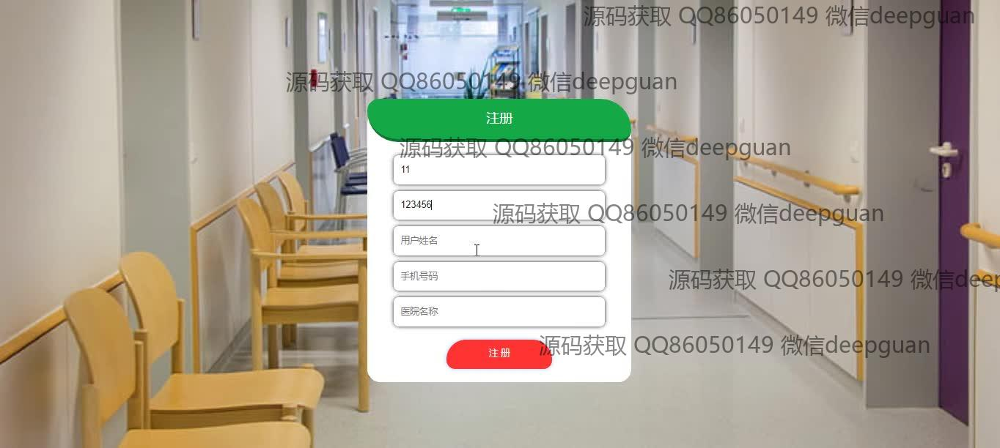
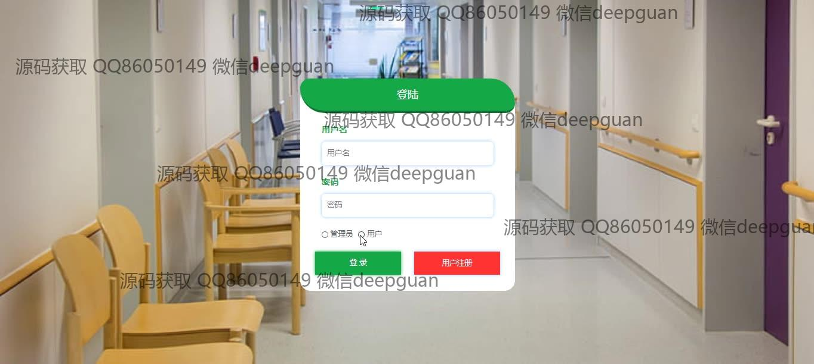
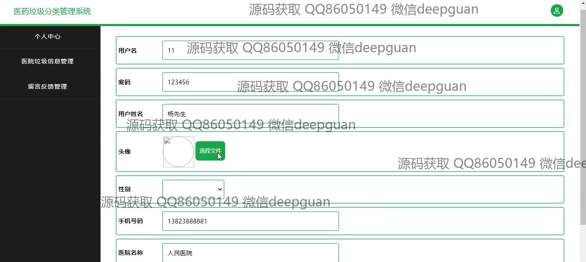
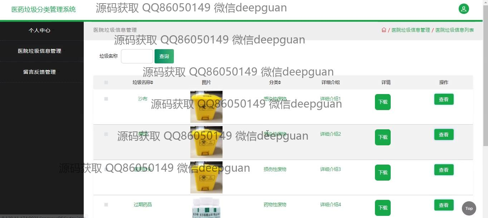
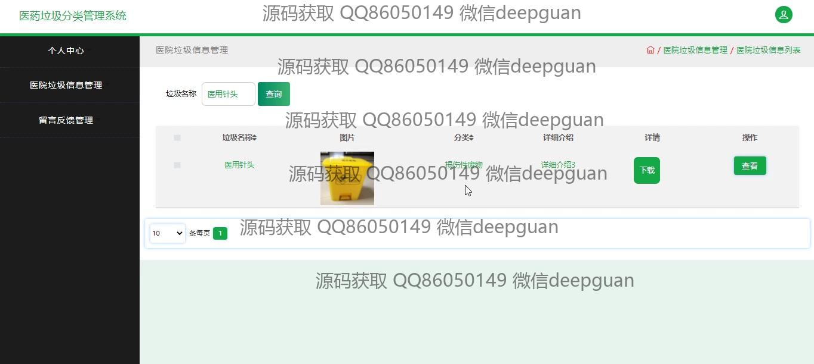
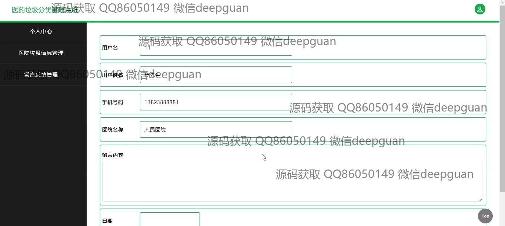
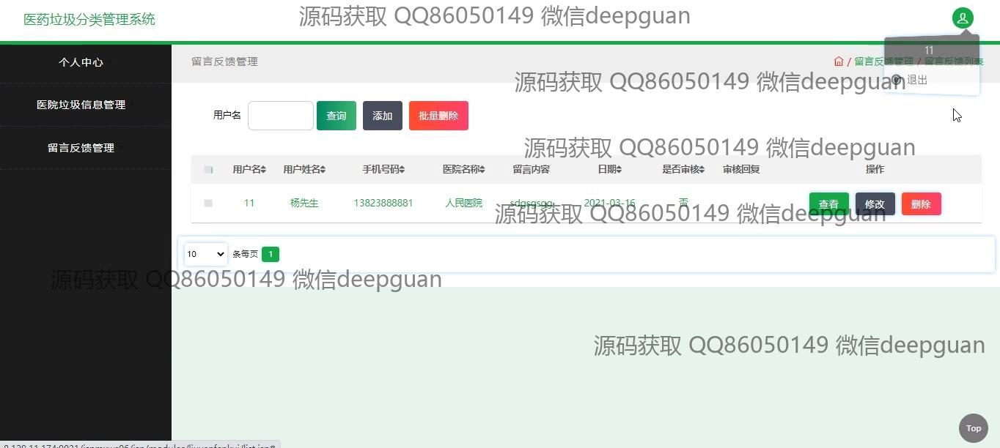
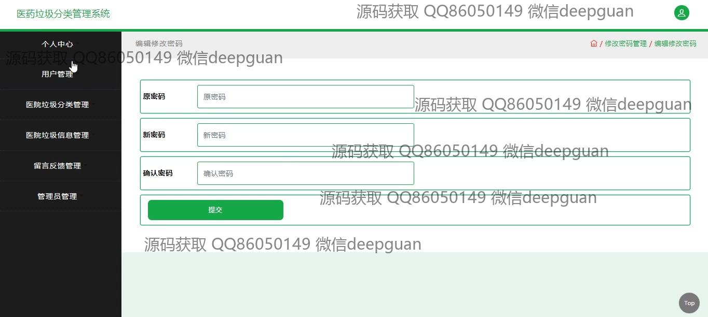

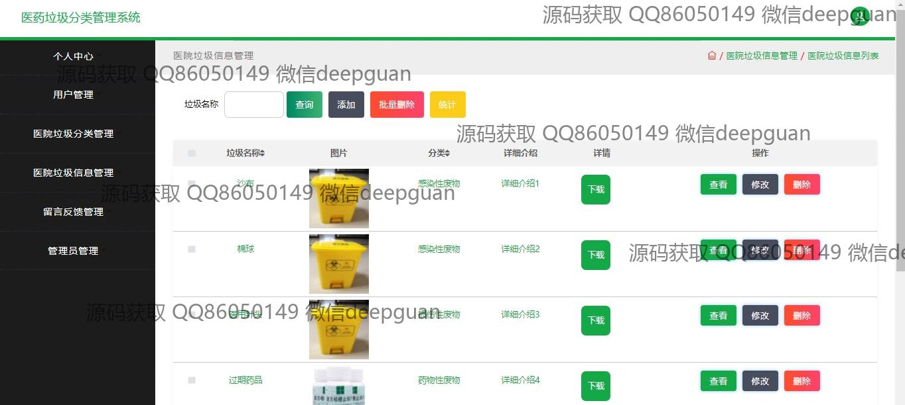
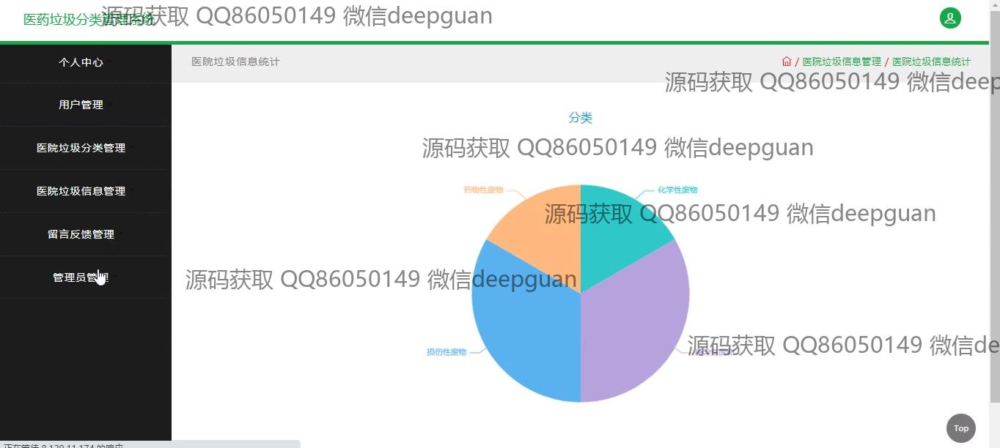
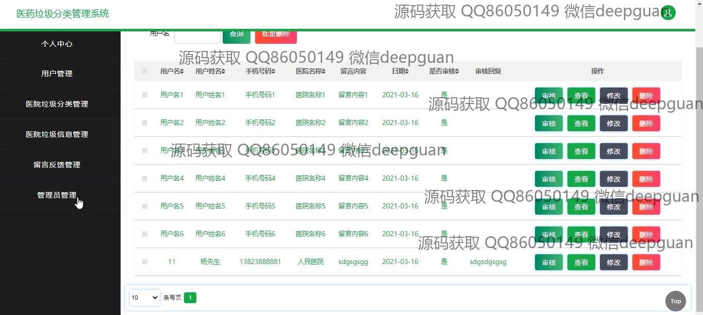
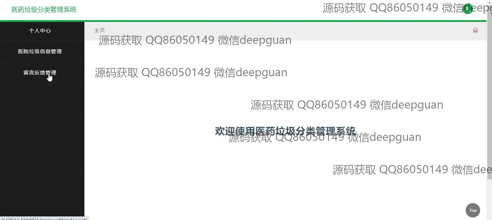

本代码来源于网络,仅供学习参考使用!

